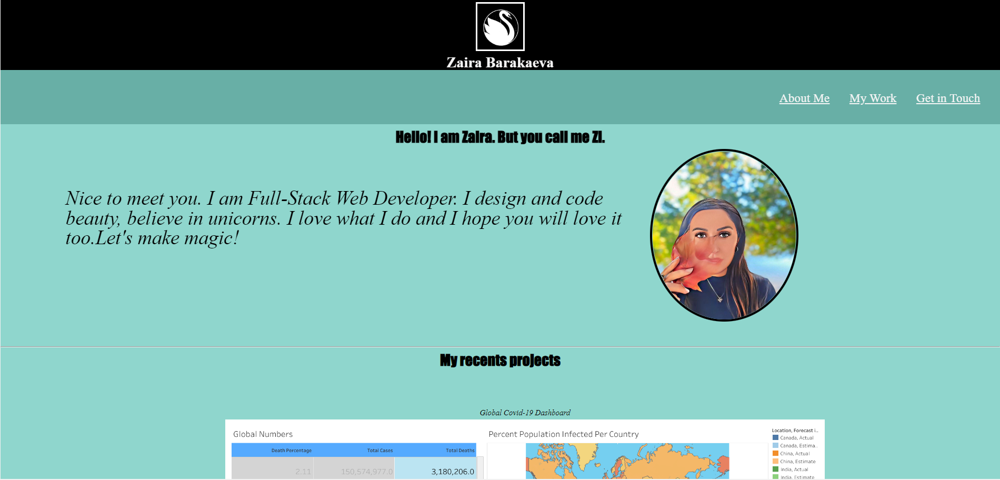

# Zi Magic Portfolio

## Desription

This project was created to display my portfolio page so to present my skills and talents to the potential employer.

The challenge helps to undestand the core skills of CSS: flexbox, media queries and CSS variables.

The page represents my name, photo, logo and sections about me , my work and how to contact me.

## Installation

N/A

## Usage

To use this page, you can review the code and styles in each section. For suggestions on what to study first, open the Chrome DevTools by pressing Command+Option+I (macOS) or Control+Shift+I (Windows). A console panel should open either below or to the side of the webpage in the browser. There you will see elements, attributes and styles we learned from the course session and how you can use them in the future.

## Credits

N/A

## License

Please refer to the license in the repo.

